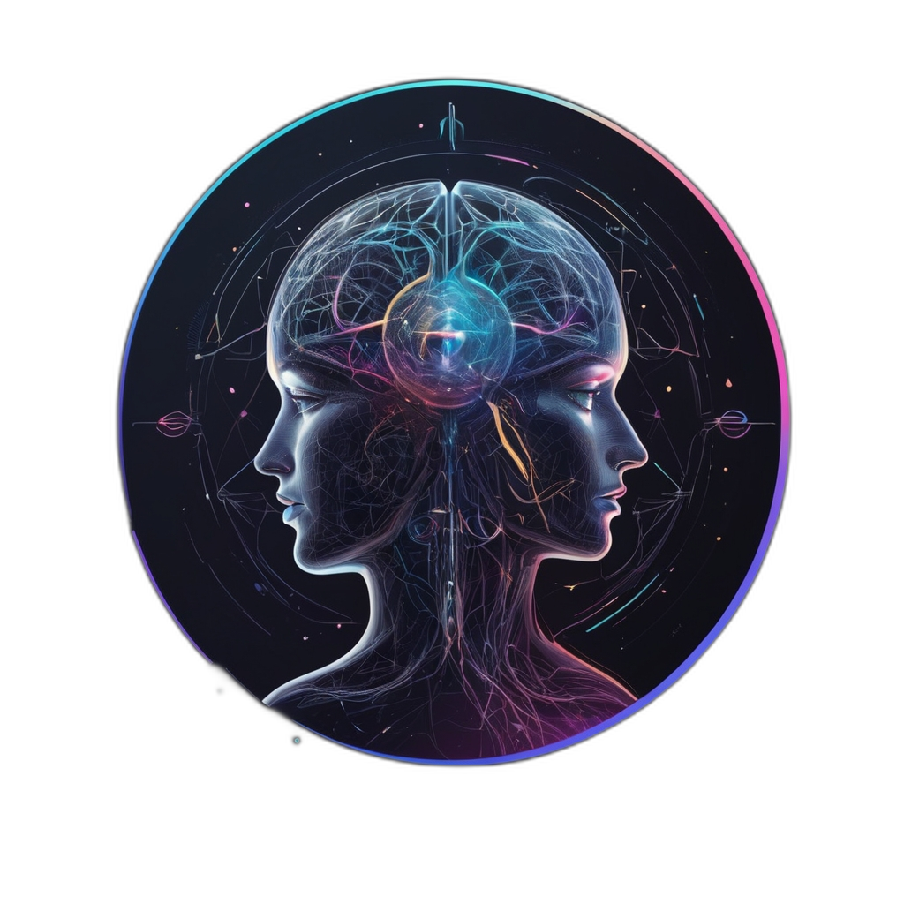

# QuantumMind - Quantum-Classical Hybrid AI Agent

A cutting-edge mobile-first conversational AI agent featuring an integrated 8-qubit quantum circuit simulator, advanced visualization engine, and collaborative quantum computing platform.

*Powered by Or4cl3 AI Solutions*

## 🌟 Overview

QuantumMind represents the convergence of artificial intelligence and quantum computing, providing an intuitive platform for exploring quantum mechanics, building quantum circuits, and engaging with an AI agent specialized in quantum computing concepts. Built with a mobile-first approach, it delivers a seamless experience across all devices.

## ✨ Key Features

### 🧠 Conversational AI Agent
- **Advanced AI Chat Interface**: Powered by Groq's Llama models with specialized quantum computing knowledge
- **Recursive Reasoning**: Sophisticated problem-solving capabilities with step-by-step quantum concept explanations
- **Context Persistence**: Intelligent memory system that maintains conversation history and learning progress
- **Voice Interface**: Full speech-to-text and text-to-speech capabilities with voice-controlled quantum operations

### ⚛️ Quantum Circuit Simulator
- **8-Qubit Simulation**: Full quantum state simulation supporting up to 8 qubits
- **Comprehensive Gate Library**: Hadamard, Pauli (X, Y, Z), CNOT, and custom quantum gates
- **Real-time State Visualization**: Live probability distributions and quantum state vectors
- **Measurement Simulation**: Quantum measurement with proper state collapse mechanics

### 🎨 Advanced Visualization Engine
- **3D Bloch Sphere Representations**: Interactive 3D visualizations for individual qubit states
- **Quantum State Evolution**: Real-time animations showing quantum state changes
- **Complex Amplitude Visualization**: Phase and magnitude representations with color coding
- **Entanglement Network Mapping**: Visual representation of quantum entanglement relationships

### 🤝 Collaborative Features
- **Community Experiment Library**: Pre-built quantum algorithms and circuits
- **Experiment Sharing**: Create, share, and discover quantum experiments
- **Interactive Challenges**: Quantum computing competitions and learning challenges
- **Social Features**: Like, comment, and rate community experiments

### 📊 Analytics Dashboard
- **Performance Monitoring**: Real-time quantum experiment and AI interaction analytics
- **Learning Progress Tracking**: Detailed insights into user engagement and skill development
- **System Metrics**: Comprehensive performance and usage statistics
- **Data Export**: Export analytics data for further analysis

### 📱 Mobile-First Design
- **Responsive Interface**: Optimized for mobile devices with touch-friendly controls
- **Progressive Web App**: Installable PWA with offline capabilities
- **Adaptive Layouts**: Seamless experience across phones, tablets, and desktops
- **Performance Optimized**: Efficient quantum simulations suitable for mobile hardware

## 🚀 Getting Started

### Prerequisites
- Node.js 18+ 
- npm or yarn package manager
- Modern web browser with Web Speech API support (for voice features)

### Installation

1. **Clone the repository**
   \`\`\`bash
   git clone <repository-url>
   cd quantummind
   \`\`\`

2. **Install dependencies**
   \`\`\`bash
   npm install
   # or
   yarn install
   \`\`\`

3. **Set up environment variables**
   \`\`\`bash
   # Create .env.local file
   GROQ_API_KEY=your_groq_api_key_here
   \`\`\`

4. **Run the development server**
   \`\`\`bash
   npm run dev
   # or
   yarn dev
   \`\`\`

5. **Open your browser**
   Navigate to `http://localhost:3000` to access QuantumMind

### Deployment

The application is optimized for deployment on Vercel:

\`\`\`bash
npm run build
npm run start
\`\`\`

## 🎯 Usage Guide

### Getting Started
1. **Landing Page**: Begin your quantum journey from the compelling landing page
2. **Loading Experience**: Enjoy the immersive loading animation as the quantum systems initialize
3. **Choose Your Mode**: Select between AI Chat and Quantum Lab interfaces

### AI Chat Interface
- **Natural Conversations**: Ask questions about quantum computing, physics, or general topics
- **Voice Interaction**: Use the microphone button for voice input and enable audio responses
- **Memory Access**: View conversation history and extracted insights
- **Suggested Questions**: Get started with pre-built quantum computing questions

### Quantum Lab
- **Circuit Building**: Add qubits and apply quantum gates using the intuitive interface
- **Voice Commands**: Use voice controls like "Apply Hadamard to qubit 1" or "Run simulation"
- **Visualization Modes**: Switch between circuit view, Bloch spheres, and state evolution
- **Measurement**: Perform quantum measurements and observe state collapse

### Collaborative Features
- **Explore Experiments**: Browse the community library of quantum circuits
- **Join Challenges**: Participate in quantum computing competitions
- **Share Creations**: Publish your quantum experiments for the community
- **Learn Together**: Comment and collaborate on quantum algorithms

## 🏗️ Technical Architecture

### Frontend Stack
- **Next.js 14**: React framework with App Router
- **TypeScript**: Type-safe development
- **Tailwind CSS**: Utility-first styling with custom design system
- **shadcn/ui**: Modern component library
- **Framer Motion**: Smooth animations and transitions

### AI Integration
- **Groq API**: High-performance LLM inference
- **AI SDK**: Streamlined AI integration with streaming responses
- **Custom Prompting**: Specialized quantum computing knowledge base

### Quantum Simulation
- **Custom Quantum Engine**: Pure JavaScript quantum state simulation
- **Complex Number Mathematics**: Accurate quantum amplitude calculations
- **Matrix Operations**: Efficient quantum gate applications
- **State Vector Representation**: Full quantum state tracking

### Data Management
- **Local Storage**: Client-side persistence for user data and preferences
- **Memory System**: Intelligent conversation and experiment tracking
- **Analytics Engine**: Comprehensive usage and performance monitoring

## 📁 Project Structure

\`\`\`
quantummind/
├── app/                          # Next.js App Router
│   ├── api/chat/                # AI chat API endpoints
│   ├── globals.css              # Global styles and design tokens
│   ├── layout.tsx               # Root layout with fonts
│   └── page.tsx                 # Main application entry point
├── components/                   # React components
│   ├── ai-chat-interface.tsx    # AI conversation interface
│   ├── analytics-dashboard.tsx  # Analytics and metrics
│   ├── collaborative-experiments-interface.tsx
│   ├── landing-page.tsx         # Marketing landing page
│   ├── loading-screen.tsx       # Immersive loading experience
│   ├── memory-interface.tsx     # AI memory management
│   ├── quantum-ai-interface.tsx # Main application interface
│   ├── quantum-circuit-simulator.tsx # Quantum circuit builder
│   ├── quantum-visualization-engine.tsx # 3D quantum visualizations
│   ├── voice-quantum-controls.tsx # Voice command interface
│   └── ui/                      # shadcn/ui components
├── lib/                         # Utility libraries
│   ├── analytics-system.ts     # Analytics data collection
│   ├── collaborative-experiments.ts # Experiment sharing logic
│   ├── memory-system.ts         # AI memory and persistence
│   ├── quantum-simulator.ts     # Core quantum simulation engine
│   └── utils.ts                 # General utilities
├── public/                      # Static assets
│   └── logo.png                 # QuantumMind logo
└── hooks/                       # Custom React hooks
\`\`\`

## 🔬 Quantum Computing Features

### Supported Quantum Gates
- **Hadamard (H)**: Creates superposition states
- **Pauli Gates (X, Y, Z)**: Single-qubit rotations
- **CNOT**: Two-qubit controlled operations
- **Custom Gates**: Extensible gate system for advanced operations

### Quantum Algorithms Included
- **Bell State Preparation**: Quantum entanglement demonstration
- **Grover's Algorithm**: Quantum search algorithm
- **Quantum Teleportation**: Quantum information transfer
- **Quantum Error Correction**: Basic error correction circuits

### Visualization Capabilities
- **Bloch Sphere**: 3D representation of qubit states
- **State Vector**: Complex amplitude visualization
- **Probability Distribution**: Measurement outcome probabilities
- **Entanglement Networks**: Multi-qubit correlation mapping

## 🎨 Design System

### Color Palette
- **Primary**: Indigo (#4F46E5) - Trust and technology
- **Accent**: Cyan (#06B6D4) - Innovation and clarity
- **Neutrals**: Sophisticated grays and whites
- **Gradients**: Quantum-inspired color transitions

### Typography
- **Primary**: Geist Sans - Modern, clean readability
- **Monospace**: Geist Mono - Code and technical content
- **Hierarchy**: Carefully crafted scale for mobile-first design

### Components
- **Mobile-First**: Touch-friendly interfaces with 44px minimum targets
- **Responsive**: Adaptive layouts for all screen sizes
- **Accessible**: WCAG AA compliant with proper contrast ratios
- **Animated**: Smooth transitions and quantum-themed effects

## 🔧 Configuration

### Environment Variables
\`\`\`bash
# Required
GROQ_API_KEY=your_groq_api_key

# Optional
NEXT_PUBLIC_APP_URL=https://your-domain.com
\`\`\`

### Customization
- **Quantum Parameters**: Modify qubit limits and gate sets in `lib/quantum-simulator.ts`
- **AI Behavior**: Adjust system prompts in `app/api/chat/route.ts`
- **Design Tokens**: Update colors and spacing in `app/globals.css`
- **Features**: Enable/disable features in component configurations

## 🤝 Contributing

We welcome contributions to QuantumMind! Please follow these guidelines:

1. **Fork the repository** and create a feature branch
2. **Follow TypeScript best practices** and maintain type safety
3. **Test quantum simulations** thoroughly for mathematical accuracy
4. **Ensure mobile responsiveness** across all new features
5. **Update documentation** for any new capabilities
6. **Submit a pull request** with detailed description of changes

### Development Guidelines
- Use semantic commit messages
- Maintain consistent code formatting
- Add unit tests for quantum simulation functions
- Verify accessibility compliance
- Test voice features across different browsers

## 📄 License

This project is licensed under the MIT License - see the [LICENSE](LICENSE) file for details.

## 🙏 Acknowledgments

- **Or4cl3 AI Solutions** - Project development and quantum AI expertise
- **Groq** - High-performance AI inference capabilities
- **Vercel** - Deployment platform and Next.js framework
- **shadcn/ui** - Beautiful component library
- **Quantum Computing Community** - Inspiration and algorithm implementations

## 📞 Support

For questions, issues, or feature requests:

- **GitHub Issues**: Report bugs and request features
- **Documentation**: Comprehensive guides and API references
- **Community**: Join discussions about quantum computing and AI

---

**QuantumMind** - Where Quantum Computing Meets Artificial Intelligence

*Built with ❤️ by Or4cl3 AI Solutions*
